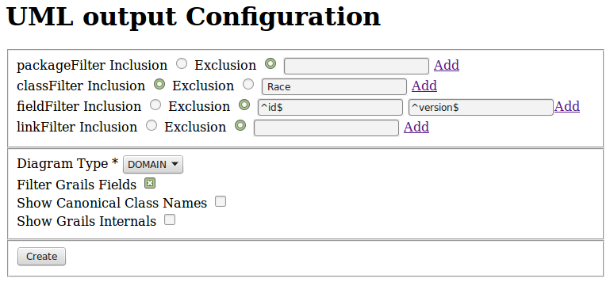
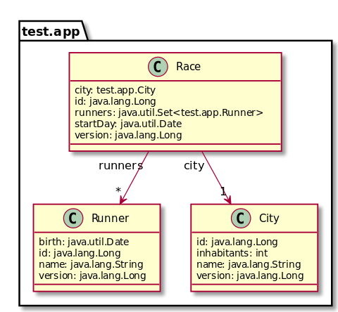
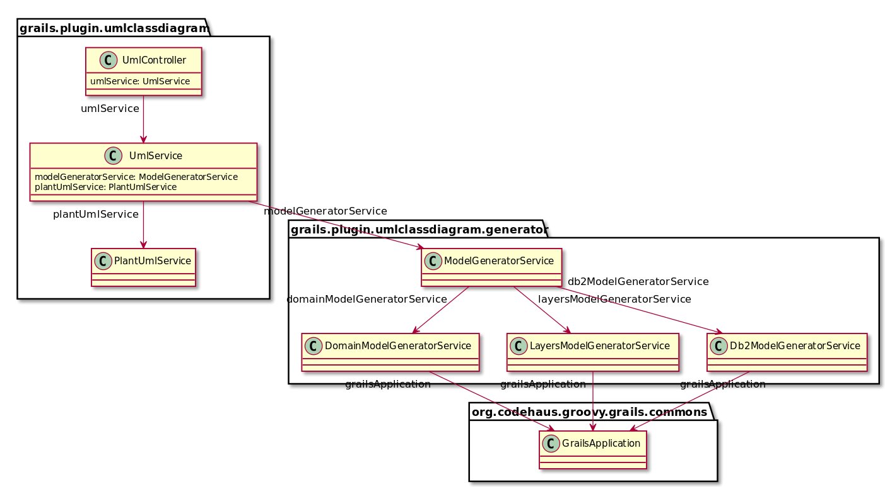

grails-plugin-uml-class-diagram
===============================

Generate UML diagrams through introspection: Domain classes, Controller/Service classes, Database schemas.

Documentation:  

* [User Guide](http://igorrosenberg.github.io/grails-plugin-uml-class-diagram/)
* [Plugin shared with the Grails Community](http://grails.org/plugin/uml-class-diagram) 
* [Source code on GitHub](https://github.com/igorrosenberg/grails-plugin-uml-class-diagram/) (this page) 
* [Changelog](changelog.md)

## Screenshots







## Features

  1. :white_check_mark: Global Class diagrams for Domain (see screenshot section above)
  1. :white_check_mark: Global Class diagrams (layered) for Controllers & Services & other beans (see screenshot section above)
  1. :white_check_mark: Global Class diagrams from DB2 database dump
  1. :white_check_mark: Diagrams exposed as specific UmlController (http interface) (see screenshot section above)
  1. :white_check_mark: Diagram generation via plantUML.jar from [PlantUML project](http://plantuml.sourceforge.net/)
  1. :white_check_mark: Configuration of the output (html wizard or directly through http GET parameters)
  1. :white_check_mark: Image output types: SVG, ~~PNG~~
  1. :clock9: Diagrams exposed as a grails script: "grails to-uml" (cli interface)
  1. :clock9: Inclusion in standard gdoc process
  1. :clock9: Output compatible with diagram manipulation software
  1. :no_entry: (Out of the scope of this plugin, see instead [swagger](http://swagger.io/)) ~~Document specifically webapp interfaces (public methods of Controllers, with javadoc, input/output spec?)~~ 
  1. :no_entry: (No longer considered useful) ~~Diagram generation using online [PlantUML server](http://www.plantuml.com/plantuml)~~ 
  1. :no_entry: (No longer considered useful) ~~Diagram generation using online [yUML](http://www.yuml.me/diagram/scruffy/class/draw)~~
  1. Works with Grails 2.x, see version 0.4.4
  1. :clock9: Works with Grails 2.x, see version 0.7 which applies http://docs.grails.org/3.2.x/guide/upgrading.html
  
## Usage

See the [User Guide](http://igorrosenberg.github.io/grails-plugin-uml-class-diagram/)

## Installation

Add `runtime ":uml-class-diagram:0.4.0"` to *BuildConfig.groovy* in the plugins section (requires grails 2.0 > \*).

The plugin depends on GraphViz. You may install it through your favorite package manager 
or via [http://www.graphviz.org/Download.php](http://www.graphviz.org/Download.php).

## Development

The steps described below are available in a [dedicated test app](https://github.com/igorrosenberg/test-grails-app/tree/local-uml-plugin)

* Create a web-app: `grails create-app web` 
* Add in BuildConfig of this new projet (adjust path as needed): 
```
grails.project.fork = [
  test: false , 
  run: false , 
  war: false , 
  console: false , 
]
grails.reload.enabled = true
grails.plugin.location.'uml-class-diagram'="../grails-plugin-uml-class-diagram"
```

Apart from the last line, we're basically turning off grails 2.3 forking process, which hampers auto-reload. 

You may also need to add _grails.reload.enabled = true_ to ../grails-plugin-uml-class-diagram/.../BuildConfig.groovy  

From then on, you can modify code in the plugin, and your "web" application reflects the changes immediately (extra step: maybe you need to run it with `grails -reloading run-app`). 

## Inspiration from 

* http://grails.org/plugin/class-domain-uml
* http://www.grails.org/plugin/create-domain-uml
* https://github.com/trygvea/grails-class-diagram/
* https://github.com/david-w-millar/grails-plantuml-plugin
* https://code.google.com/p/grails-domain-uml/source/browse/#svn%2FCreateDomainUml
* http://sdedit.sourceforge.net/
* https://www.websequencediagrams.com/

