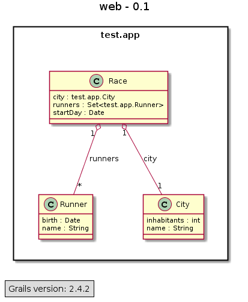
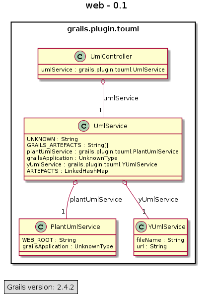

grails-plugin-uml-class-diagram
===============================

Generate UML diagrams from your Grails app source code.
   
## Features

  1. :white_check_mark: Global Class diagrams for Domain  (see screenshot section below)
  1. :white_check_mark: Diagram generation using online [PlantUML server](http://www.plantuml.com/plantuml) (ie no need to rely on plantUML.jar - no local image generation) 
  1. :white_check_mark: Diagrams exposed as specific UmlController (http interface)
  1. :white_check_mark: Global Class diagrams (layered) for Controllers & Services & other beans (only public methods, no javadoc comments)
  1. :white_check_mark: Diagrams exposed as a grails script: "grails to-uml" (cli interface)
  1. :white_check_mark: Diagram generation in PNG via plantUML.jar from [PlantUML project](http://plantuml.sourceforge.net/)
  1. :soon: Configuration of the data exposed (through config properties)
  1. :soon: Configuration of the data exposed (through an html page)
  1. :clock9: Inclusion in standard gdoc process
  1. :clock9: Diagram generation using online [yUML](http://www.yuml.me/diagram/scruffy/class/draw) (different syntax)
  1. :no_entry: (Out of the scope of this plugin) ~~Document specifically webapp interfaces (public methods of Controllers, with javadoc, input/output spec?)~~ 
  
## Finished tasks

* (v0.2.0) Refactor (pass1) script / controller / service (UmlController | UmlService | PlantUmlService |YumlService)
* (v0.2.0) domain introspection result to diagram spec
* (v0.2.0) domain >> all fields not external (ie excluding hasmany)
* (v0.2.1) domain >> list dependencies (hasmany)
* (v0.2.3) Config options (fieldFilterRegexps classFilterRegexps showCanonicalJavaClassNames diagramType)
* (v0.2.4) grails introspect 
  * controllers >> list dependencies
  * services >> list dependencies
* (v0.2.5) Config options (showGrailsInternals)
* (v0.2.6) plantUml diagram spec to PNG byteStream, 
* (v0.2.6) Config options (renderingEngine)
* (v0.3.0) plantUml diagram spec to PNG file (script mode)
* (v0.3.1) published as public grails plugin, see http://grails.org/plugin/uml-class-diagram
  
## Ongoing tasks  

* Config options (showCanonicalClassNames duplicateFieldAndArrow)
* Refactor UmlService (too much duplication) ==> Domain vs Controller/Service should not be separate methods
  * see grailsApplication.serviceClasses() , can that help ?

## Future tasks

* ~~Correct UmlService (Graph representation) ==> in the classData, the associations field is a duplicate of the properties field~~
* ~~grails introspect controllers, services >> public methods~~ (currently out of the scope of this UML plugin)
* ~~plantUml Class diagram spec (non trivial example)~~
* ~~plantUml Dependency diagram spec (non trivial example)~~
* GSP View exposing the Config Command object
* Script builds a Config Command object (script parameters and/or config options)
* Config option: no duplication = if isAssociation, don't list in properties
* Refactor (pass2) UmlController | UmlService | PlantUmlService |YumlService
* Yuml as secondary option
* Documentation of the plugin (specifically: ConfigurationCommand, controller mode, script mode, rendering engines)
* gdoc inclusion of the script
* script : controller/services/domains >> to PNG files in target output folder 
```
    includeTargets << grailsScript("_GrailsBootstrap")
    loadApp()
    for (grailsClass in grailsApp.allClasses) { println grailsClass }

    configureApp()
    Connection c = appCtx.getBean('dataSource').getConnection()
```  

## Inspiration from 

* http://grails.org/plugin/class-domain-uml
* http://www.grails.org/plugin/create-domain-uml
* https://github.com/trygvea/grails-class-diagram/
* https://github.com/david-w-millar/grails-plantuml-plugin
* https://code.google.com/p/grails-domain-uml/source/browse/#svn%2FCreateDomainUml

## Installation

Add `runtime ":uml-class-diagram:0.3.1"` to *BuildConfig.groovy* in plugins section (requires grails 2.0 > \*).

## Development

* Create a web-app: `grails create-app web` 
* Add in BuildConfig of this new projet (adjust path as needed): 
```
grails.project.fork = [
  test: false , 
  run: false , 
  war: false , 
  console: false , 
]
grails.reload.enabled = true
grails.plugin.location.'uml-class-diagram'="../grails-plugin-uml-class-diagram"
```

Apart from the last line, we're basically turning off grails 2.3 forking process, which hampers auto-reload. 

You may also need to add _grails.reload.enabled = true_ to ../grails-plugin-uml-class-diagram/.../BuildConfig.groovy  

From then on, you can modify code in the plugin, and your "web" application reflects the changes immediately.

## Usage

1. Run your grails app 
2. Point your web browser to `http://localhost:8080/yourApp/uml`
3. (more specifically, if you want programmatical control on the output) 
```
curl -v -H "Content-Type: application/json" -d '{"fieldFilterRegexps"=["^id$","^version$"],"classFilterRegexps"=[".*City"],"diagramType"="DOMAIN","showCanonicalJavaClassNames":false}' http://localhost:8080/yourApp/uml 
```

## Screenshots




